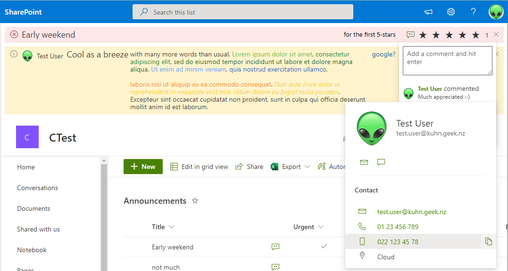
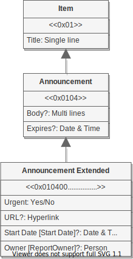

# Announcements bar Sharepoint extension



[](https://lerna.js.org/)

## Overview

This is an announcements bar for Sharepoint, featuring comments, likes, ratings.

Here you can follow:

- **[install & go](#install--go)** to quickly use the extension.
- **[install customized](#install-customized)** to use the extension with a customized setup.
- or read and code as part of the [reusable hybrid repo mvc spfx examples](https://github.com/mauriora/reusable-hybrid-repo-mvc-spfx-examples).

  This one hopefully illustrates:
  - create a model extended from existing SharePoint Announcements for the SharePoint access
  - use out of the box features like likes, comments
  - little specific code needed
  - create separate deployment packages for extension and lists

## Table of contents

1. [Install & go](#install--go)
2. [Install customized](#install-customized)
3. [Minimal path to awesomeness](#minimal-path-to-awesomeness)
4. [Build and install](#build-and-install)
5. [Caveats](#caveats)
   1. [Blank page for installation error](#blank-page-for-installation-error)
6. [Details](#details)
   1. [Content type](#content-type)
7. [Contribute](#contribute)
8. [Create new project](#create-new-project)

## Install & go

1. [In your sharepoint app store](https://YOUR-TENANT.sharepoint.com/sites/apps/AppCatalog/Forms/AllItems.aspx)
`Upload`
    - [app/Announcements-Lists-Deployment/sharepoint/solution/**announcements-lists-deployment**.sppkg](app/Announcements-Lists-Deployment/sharepoint/solution/announcements-lists-deployment.sppkg)
    - [app/Announcements-Bar-Extension/sharepoint/solution/**announcements-bar**.sppkg](app/Announcements-Bar-Extension/sharepoint/solution/announcements-bar.sppkg)
        - Tick the option `Deploy tenant wide`
2. Create a new team site called `news`
    1. On the `site content` page of the `news` site
    2. Click `+ New` -> `App`
        - Find `Announcements Bar lists`
        - Click `Add`
3. With your new `Announcements` list
    1. If you want use likes or ratings, enable them in `Settings` -> `Rating settings`
    2. Add an announcement 🙂

## Install customized

### Changing the list or site name

To be able to deploy the extension tenant wide, without powershell configuration, create the lists
*`Announcements`*  and *`AcknowledgedAnnouncements`* on the site `/sites/news`. If the list names or site name differ, then the Announcements bar needs to be installed/configured using power shell on each site
it's installed. Alternatively you can rebuild the package to suit your defaults.

### Upload to the app store

[Navigate to your sharepoint app store](https://YOUR-TENANT.sharepoint.com/sites/apps/AppCatalog/Forms/AllItems.aspx)

#### Lists and content types deployment

**If** you want to re-use and extend an existing Announcements list **then**, upload:

- [app/Announcements-Model-Deployment/sharepoint/solution/announcements-**model-deployment**.sppkg](app/Announcements-Model-Deployment/sharepoint/solution/announcements-model-deployment.sppkg)

  This contains a list for acknowledged announcements and the extended announcements content type.

**else if** you want to create a new Announcements list **then**, upload:

- [app/Announcements-Lists-Deployment/sharepoint/solution/announcements-**lists-deployment**.sppkg](app/Announcements-Lists-Deployment/sharepoint/solution/announcements-lists-deployment.sppkg)
  
  This contains a list for acknowledged announcements, the announcement list and the extended announcements content type

#### Announcements Bar

Upload [app/Announcements-Bar-Extension/sharepoint/solution/**announcements-bar**.sppkg](app/Announcements-Bar-Extension/sharepoint/solution/announcements-bar.sppkg). If you want the bar to show
on each site of the tenant, tick `Deploy tenant wide`. Otherwise you can install it on each site later by going the sites `Site Content`:

- Click `+ New` -> `App`
- Find `Announcements Bar`
- Click `Add`

### Hosting site

To use the like/rating feature, a team site is required, otherwise a communication site will be fine.
The hosting site must host both lists, `Announcements` and `AcknowledgedAnnouncements`.
By default the hosting site is `sites/news`.

### Install the deployment package

On the `site content` page of the site hosting the Announcements:

1. Click `+ New` -> `App`
   - Find `Announcements Bar lists` or `Announcements Bar model`
      - Click `Add`

#### Extend an existing announcements list

Follow this if you've chosen the `Announcements Bar model` deployment package.

Open `Settings` for the _announcement_ list

- In `Advanced settings`
  - Enable management of content types
  - Disable attachments
- In `Add from existing content types`
  - Add `Announcements Extended`
- Click on the default item content type (or other pre-existing)
  - delete this content type
- Optional for ratings (this only works on team sites)
  - Select `Rating settings`
    - Rating Settings: **Yes** or (**No** if you want to disable ratings)
    - Which voting/rating experience you would like to enable for this list?
      - `Likes` if you want to show the Thumbs icon and count
      - `Star Ratings` if you want to show the 5-star rating

#### Deploy the bar extension

[In your sharepoint app store](https://YOUR-TENANT.sharepoint.com/sites/apps/AppCatalog/Forms/AllItems.aspx)
`Upload`
[app/Announcements-Bar-Extension/sharepoint/solution/announcements-bar.sppkg](app/Announcements-Bar-Extension/sharepoint/solution/announcements-bar.sppkg)

Select [x] `Deploy tenant wide` if you used the above default settings and want the bar to appear on every modern site.

### Use Powershell to change listname or site name

If you didn't host Announcements on `sites/news`, and or used different names for the lists, then you need to open PowerShell to add the extension to each site:

1. `Connect-PnPOnline -Url https://YOUR-TENANT.sharepoint.com/sites/YourSite`
2. Modify the `{'listName': 'Announcements', 'acknowledgedListName': 'AcknowledgedAnnouncements', 'siteUrl': '/sites/News'}` to point to your site containing your announcements _announcement_ list and _acknowledged_ list from earlier:

    Depending on your pnp / powershell version, the `ClientSideComponentProperties` need to be escaped different:

    ``Add-PnPCustomAction -Name "Mauri-Ora-Announcements-Bar" -Title "Mauri-Ora-Announcements-Bar" -Location "ClientSideExtension.ApplicationCustomizer" -ClientSideComponentId "f4e7b2fc-be9a-43de-bb92-4a67c3f72793" -ClientSideComponentProperties "{ `"listName`": `"Announcements`", `"acknowledgedListName`": `"AcknowledgedAnnouncements`", `"siteUrl`": `"/sites/News`"}"``

    or

    ``Add-PnPCustomAction -Name "Mauri-Ora-Announcements-Bar" -Title "Mauri-Ora-Announcements-Bar" -Location "ClientSideExtension.ApplicationCustomizer" -ClientSideComponentId "f4e7b2fc-be9a-43de-bb92-4a67c3f72793" -ClientSideComponentProperties "{'listName': 'Announcements', 'acknowledgedListName': 'AcknowledgedAnnouncements', 'siteUrl': '/sites/News'}"``

If you have issues, check the browser logs, `Announcements onInit` logs an object with an `properties` object containing `listName`, `acknowledgedListName` and `siteUrl`.

## Minimal path to awesomeness

[Upload to the app store](#upload-to-the-app-store) the [lists and content types deployment](#lists-and-content-types-deployment) package of your choice. On your [Hosting site](#hosting-site) [install the deployment package](#install-the-deployment-package)

### Requirements

You should have the following installed:

- Code editor
- Node 14
- yarn
- GitExtension (the program, if your contributing or forking a new project of this)

### Install the workspace

```shell
git clone --recurse-submodules https://github.com/mauriora/Announcements-Bar-Spfx.git
cd Announcements-Bar-Spfx
yarn boot
lerna run build
code .
```

### Serve the extension

Edit [app\Announcements-Bar-Extension/config/serve.json](app/Announcements-Bar-Extension/config/serve.json)

- set *pageUrl* to the page you want to test your extension on
- in properties, set siteurl to the [Hosting site](#hosting-site)

open a terminal in the solution (root) folder

```shell
yarn serve
```

a browser will open and navigate to *pageUrl*

### Build and install

1. In a solution terminal execute `lerna run build`
2. Either [Install & go](#install--go) or [Install customized](#install-customized)

## Caveats

### Blank page for installation error

To see the installation errors, go to `Site content` using the `classic experience`.
Locate the failed package and:

- click the more menu (`...`)
- Click `DETAILS`
- In the `Errors` section
  - Click on the number to the right of `Install Errors`
  - A baloon popup should appear showing the error(s)

If you see a blank page, open `PowerShell` with `pnp` and execute:

```shell
    Connect-PnPOnline -Url "https://<YOURTENANT>-admin.sharepoint.com" -interactive
    Set-PnPTenantSite -Identity "https://<YOURTENANT>.sharepoint.com/sites/<YOURSITE>" -DenyAddAndCustomizePages:$false
```

## Details

## Submodules

Depending on the stage or kind of your development, you may not want to download and build all submodules.
You can `unloadModules` wich are published.

You could also [Install the workspace](#install-the-workspace) by cloning the solution and loading only the modules you need:

```shell
git clone https://github.com/mauriora/Announcements-Bar-Spfx.git
cd Announcements-Bar-Spfx
yarn boot
yarn loadModules .\app\Announcements-Bar-Extension\ .\app\Announcements-Lists-Deployment\
lerna run build
```

### Load or unload submodules

### Content type hierarchy



## Contribute

Use the minmal path to awesomeness and please create a fork and branch for your contribution.
Then do a pull request to merge your branch into the main branch.

## Create new project

1. Fork the solution as *YOUR-SOLUTION*
2. Clone the forked solution
3. Fork the starting app project as *YOUR-PROJECT*
4. Add the *YOUR-PROJECT* as submodule to *YOUR-SOLUTION* using the app GitExtenson, manage sub modules
5. Remove the starting project, and any other you don't need, from YOUR-solution using the app GitExtenson, manage sub modules
6. call `yarn generateNewGuidsResetVersions` in apps/*YOUR-PROJECT*
7. rename *YOUR-.....* in:
    - app/*YOUR-PROJECT*
        - package.json
        - src/extensions/*YOUR-EXTENSION*
            - *YOUR-EXTENSION*.manifest.json
        - config
            - config.json
            - package-solution.json
        - sharepoint/assets/*
8. Copy the *id* value from *YOUR-EXTENSION*.manifest.json as *componentId*, and the *alias* value as *title*  to
   - config
      - serve.json
   - sharepoint/assets/
      - elements.xml
      - ClientSideInstance.xml
